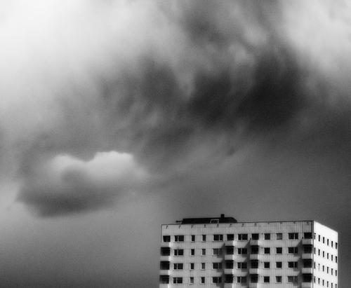

[(Dark Cloud II by Daniel Staver)](http://daniel.staver.no/home)

Love hate relationship with the Amazon EC2 service blossoms deep in LEXATEXY’s veins. Are these problems endemic of anyone trying to do things on more than a few computers? We’re at a point now where people will slowly forget what it’s like to have to call a guy to pull the power on your computer. Remote hands! Paying a $200 setup fee to install 2GB of RAM!

My litany of virtualized woe includes:

1. Instances rebooting with no warning. Sometimes the OOM Killer is to blame, but not always.
2. Run afoul of the default instance limit (20!) right before a deployment. Luckily we had another AWS account and it’s pretty easy to share images. And that day our friendly AWS Account Manager called me and bumped it to 120 (which we filled up that day on [cowbell](http://morecowbell.dj) workers/[analyze](http://the.echonest.com/analyze) renderers)
3. An instance turning “frozen.” The API returns a handle to it, but you can’t SSH or anything into it and the reboot call doesn’t do anything. You have to kill it, and sometimes that doesn’t work either.
4. (This was a new one, just today) Instance loses internet DNS connectivity (i.e. host nytimes.com hangs.) You have to reboot the instance to get it back.
5. Some well meaning log generator fills up /var/log or /tmp on the real pauce root volume (8GB!) 
6. Set up a distributed DB or MR task with a lot of inter-instance comms and you realize that three of your sixteen instances are on different availability zones. 
7. Pre-EBS, doing _anything_ byte-fiddly on the “local” disk and watching the IO “speed.” We were seriously ready to drop EC2 altogether right before EBS came along.
8. Helpful contractor de-allocating your elastic IP and allocating it to their instance just because.
9. SSH host key changing on reboot. WHY DO YOU HURT ME
10. Saved a lot of money and did some things that would have been impossible otherwise.
