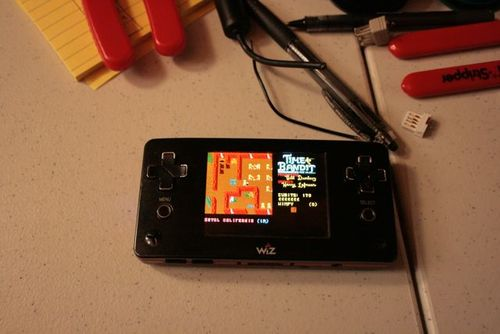

One thing i forgot to mention in my overview of the [eminently hackable DSP friendly GP2X Wiz](http://notes.variogr.am/post/145353397/small-but-powerful-devices-that-run-your-code#wiz) is that it also _can be a portable Atari ST._ I will have to buy another one to use for “work” I guess. If you showed this picture to my 11 year old self… well, I guess I would have said “that’s a huge pen!” Pictured is [Time Bandit](http://www.atarilegend.com/interviews/interview.php?interview_id=4), definitely the best Atari ST game (though there were many.) I cut my teeth on this machine, so forgive the brief nostalgia. Now, I wonder if the MIDI ports get routed over USB on this thing….
