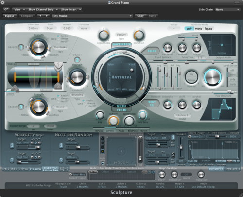

Hadn’t opened a DAW in a while, this is what greeted me – the Sculpture synth from Logic 9. It’s fascinating that in the last ten years synthesizers evolved into toddlers’ busy boxes, or maybe Radio Shack 500-in-1 electronics kits. Wondering who or what is driving the features and design: I don’t see anything here either in UI or DSP that couldn’t have been done with 1999 technology – the growth has nothing to do with ability; so it’s some other external customer request, or the more bitter explanation of marketing flotsam.

Hopefully I can pull together a retrospective of VST plugin UIs and features over the years.
