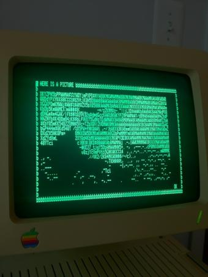

I spent a good six hours building this Apple //c Information Kiosk. It’s hilarious! You can type in any band name (that existed 1984 or earlier OF COURSE) and it shows you a picture and their bio. Or in automatic mode just scrolls through a set of pop artists around that time (via [this amazing Echo Nest API call](http://developer.echonest.com/api/v4/artist/search?api_key=N6E4NIOVYMTHNDM8J&format=json&results=100&artist_start_year_before=1984&sort=familiarity-desc&artist_start_year_after=1980&style=pop).

You can [run it yourself if you have the right hardware](https://github.com/echonest/kiosk), here’s my [HOWTO](https://github.com/echonest/kiosk/blob/master/README.md).
