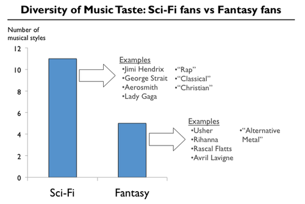

_Heart of Glass_

I’m a music person: I’m a musician, I pack up all my life experiences through the lens of records and bands, and I’ve spent 15 years of my life building the [world’s best automated music recommender.](http://the.echonest.com) I think there’s something terribly personal about music that other forms of “media” (books, movies, television, articles and – recent entry alert – _applications_) can’t touch. A truly great song only takes [a minute and forty four seconds](http://www.youtube.com/watch?v=83fpEaEET7k) to experience, and then you can hit the repeat button. I can hear “Outdoor Miner” 31.7 times on my walk to work every morning if I wanted to. But I can’t watch one of my favorite movies, Werner’s “[Heart of Glass](http://en.wikipedia.org/wiki/Heart_of_Glass_(film)),” even once on my walk to work, and to be honest, more than once a year is a bit much. I’d have to be staring at my phone or through some scary glasses. And it’s a distracting world, far too much to fit into the diorama of the brain: dozens of actors, scenes, sounds, props and story. I don’t know if I attach memories or causal emotion to movies: they try to _explicitly tell me how to feel_, not suggest it obliquely or provide a soundtrack to a reality. And worst of all, it’s a mood killer to give a fledgling romantic partner a mix “DVD-box-set.”

But certainly, my preference in film (or that I even call them _films_ – like some _grad student_) has to tell me something about myself, or even my other tastes. If we knew someone’s movie preference, could we build a better music playlist for them? Or can we help you choose a movie by knowing more about your music taste? I recently poked out of my own bubble of music recommendation and music retrieval to see if there were any correlations we could make use of.

### Recommending in general

<blockquote class="twitter-tweet">
“Suggested friends” in a social network: people you already know but don’t like. Now, apply that brilliant algorithm to music recommendation
— Brian Whitman (@bwhitman) <a href="https://twitter.com/bwhitman/statuses/343005710952570880">June 7, 2013</a></blockquote>

[//platform.twitter.com/widgets.js](//platform.twitter.com/widgets.js)

[The way the Echo Nest has done music recommendation](http://notes.variogr.am/post/37675885491/how-music-recommendation-works-and-doesnt-work) is actually quite novel and deserves a quick refresher: we don’t look at what most other companies or technologies do. Amazon, Last.fm, iTunes Genius and many others use statistics of your _activity_ to determine what you like: if you listen to Can, and so does a stranger, but that stranger also loves Cluster and the system presumes you don’t know about them, you might get recommended Cluster. But that doesn’t know anything about music and it constantly fails in its own naïve way:

  
_Colin Powell recommendation from Britney Spears_

Instead of relying on that brittle world of correlated activity, we’ve first built a music understanding system that gets what music is: what people say about it and what it sounds like, and that platform also happens to recommend things and give you playlists. We use all of that data to power top rate discovery for tons of services you use every day: Rdio, Sirius XM, Nokia’s MixRadio, iHeartRadio, MTV, the [Infinite Jukebox.](http://labs.echonest.com/Uploader/index.html?trid=TRZXKBT13B3F59AADE) We don’t just know that you like a song, we know what the key of that song is, how many times people called it “sexy” in the past week on blogs, and what instruments are in it. We also know, through the anonymized Taste Profile: how often you, and the world, listened, what time of day, and what songs you like to listen to before and after and how diverse your taste is.

The reason this is useful is we don’t want to just build a thing that knows that “people that like The Shins also like Garden State,” we want to go deeper. We want our models to understand the underlying music, not just the existence of it. We also want to show correlations between styles and other musical descriptors and types of films, not just artists. Facebook could (and it probably tries to) build a music “recommender” by just checking out the commonalities of what people like, but we want to look deeply at the problem, not the surface area of it.

## Experimental setup

The Echo Nest is currently pulling in hundreds of musical activity data points a second, through our partners and our large scale crawls of the web and social media. A recent push on our underlying [Taste Profile infrastructure](http://notes.variogr.am/post/26869688460/how-well-does-music-predict-your-politics) nets us new data on the listeners themselves – specifically, with anonymously collected and stored demographic and non-music media preferences. Through all of this we know the favorite artists and movies for a large set of Taste Profiles (if you’re a developer, you can store non-musical data using our [Taste Profile Key-Value API](http://developer.echonest.com/docs/v4/catalog.html#keyvalues) and manipulate and predict new features using our alpha [Taste Profile predict API](http://developer.echonest.com/docs/v4/catalog.html#predict-alpha).) For the purposes of this experiment, we limited our world to 50,000 randomly chosen Taste Profiles that had movie and music preference data.

  
_Musical attributes for ABBA_

Each artist was modeled using Echo Nest cultural attributes: a sparse vector of up to 100,000 “terms” that describe the music in the Taste Profile, weighted by their occurrence. If someone constantly listens to the new [James Holden record](http://pitchfork.com/advance/136-the-inheritors/), and I mean, over and over again, kind of annoyingly, we weight terms like “bedroom techno” and “melodic” along with the acoustically derived terms – its energy, danceability and so on – higher than songs they’ve just heard once or twice. The output vector is a human-targeted cultural description of their favorite music, with helpful floating point probabilities P(X|L) for each term denoting: “How likely would it be for this listener to describe their taste as ‘X’”?

The movie data was a bit harder, noting for the record that we are a music data provider run by some musicians who happened to be good with computers. I deployed a small crack team (the CTO and his imaginary friends) to build a mini “Echo Nest for movies,” cataloging (for now) 5,000 of the most popular films along with their descriptors culled from descriptions and reviews in a similar way as we’ve done for music. I determined their genres, lead actors, key attributes and cultural vectors to train models against.

  
_Movie attributes for The Godfather_

### Predictions

By training thousands of correlative models between the sparse music vectors and the various target ground truth of the movie attributes (which were in reality far less diverse and dense) we are able to quickly view high affinity between various types of music and types of movies.

  
_KL divergence doing its thing_

I used a multi-class form of the [Support vector machine](https://en.wikipedia.org/wiki/Support_vector_machine), regularized least-squares classification, which you can read about in an [old paper of mine](http://scholar.google.com/citations?view_op=view_citation&hl=en&user=eiTakp4AAAAJ&citation_for_view=eiTakp4AAAAJ:UeHWp8X0CEIC) to train the thousands of models. RLSC is fine with sparse vectors and unbounded amounts of output classes, and we also ended up with a linear kernel which made the training step very light – likely due to the low rank of the movie features.

I evaluated the models in two ways: the first I’ll call a “discriminant classifier” – this will list the most useful sources of information ([KL divergence](http://en.wikipedia.org/wiki/Kullback%E2%80%93Leibler_divergence)) for a given music source, and the second is a “ranked classifier” – given popularity features, what would give the least surprise for the classifier. There’s good reasons for the two methods: the former is more statistically correct, but ignores that most people have never heard of most things, while the latter gives us safe bets that give less explicit information.[1](p53245962722-1) As we see every day with music, a computer’s idea of “information” rarely has little to do with things like the success of “Fast & Furious 6.”

For example, I am able to ask it both: “If an average person likes Jay-Z, what are their favorite movies” (ranked) and “Which movie can I assume predicts the liking of Jay-Z”? (discriminant). They are:

| Ranked | Discriminant |
| --- | --- |
| Toy Story  
Step Brothers  
Buddy The Elf  
Harry Potter (series)  
Jackass  
Superbad  
Fight Club  
 | Get Rich or Die Tryin’  
Paid in Full  
Scary Movie 4  
Shottas  
Juice  
New Jack City  
Friday After Next  
 |

_Movie predictions for fans of Jay-Z_

You can see the difference: the left side is the safe bets (everyone likes Toy Story! everyone likes Jay-Z!) and the right side is the less known but more useful results. So you don’t think I’m pulling a [Shawshankr](http://shawshankr.com/)[2](p53245962722-2) on you, here’s the list for a different artist:

| Ranked | Discriminant |
| --- | --- |
| Dirty Dancing  
Toy Story  
The Blind Side  
Twilight (series)  
The Notebook  
Finding Nemo  
Dear John  
 | Pure Country  
8 Seconds  
Country Strong  
Valentine’s Day  
Sweet Home Alabama  
Letters to Juliet  
The Vow  
 |

_Movie predictions for fans of Tim McGraw_

We can also bulk this up by features of the movie, here are the top musical artists correlated with movies with a heavy crime element:

| Ranked | Discriminant |
| --- | --- |
| Jimi Hendrix  
The Beatles  
The Rolling Stones  
Jay-Z  
The Who  
Bob Dylan  
Pink Floyd  
 | Ghostpoet  
Amazing Blondel  
Ian Anderson  
Doseone  
Young Gunz  
Mandrill  
Pato Banton  
 |

_Artist predictions for fans of crime movies_

Seeing the [Amazing Blondel](http://en.wikipedia.org/wiki/Amazing_Blondel) there just amazes me: we track two and a half million artists and it’s those guys that like crime movies? The data can’t lie.

We also looked up which movies our term computations considered “pornographic” or “adult” (they know it when they see it:)

| Ranked | Discriminant |
| --- | --- |
| Linkin Park  
The Beatles  
The Rolling Stones  
Deftones  
Limp Bizkit  
Korn  
Rage Against the Machine  
 | The Receiving End of Sirens  
Haste the Day  
The Dillinger Escape Plan  
The Mars Volta  
Far \* East Movement  
Rediscover  
Imogen Heap  
 |

_Artist predictions for fans of adult movies_

Fans of “Christian metalcore”-rers [Haste the Day](http://en.wikipedia.org/wiki/Haste_the_Day) and Imogen Heap, we’re onto you. We don’t judge.

### Overall

We did a lot more analysis, more of which you can see over on The Echo Nest’s new [Musical Identity](http://musicalidentity.echonest.com) site, including breakdowns of different genres of films:

  
_Sci-fi vs. Fantasy_

The goal of all of this is to understand more about music and the identity we express through our affinity. We’re getting closer with a lot of these large scale analyses of different forms of media and demographic and psychographic predictions from solely preference. But it’s also going to help us elsewhere: being able to recommend you that one song or artist with not much information is what we do, and the more we can predict from what we used to think of as orthogonal sources, the better.

* * *

1. For the scientists getting mad: the ranked classifier applies a smoothed weight of terms by their document frequency – the number of times we saw a movie being mentioned. [↩](p53245962722-1)
    

3. The more precise movie recommender with the worst recall [↩](p53245962722-2)
