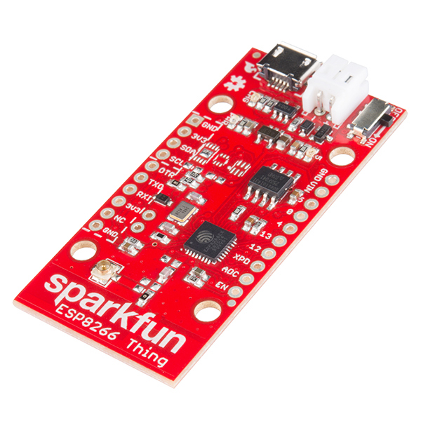

We built a [device to measure bread as it rises](https://github.com/bwhitman/bread-detector) and in the process I gave a lot of thought to tools and inventors.

If you create meticulous tools and platforms, only a tiny fraction of the world is going to have the desire and knowledge to latch on. Your best hope is to be bright enough for other tool-builders to swarm to, and then [hope the weight of the pyramid stacked on top of you won’t kill you.](https://medium.com/inside-wattage/well-we-failed-77e795e16ecf) It might be that the startup fan fiction of “prosumer builders” simply doesn’t have a quorum strong enough to fund an industry – maybe their one-off projects remain, just that, jumper wires in a shoe box. The technologists and inventors I know tend to avoid reliance on existing platforms; we desire total control, we want to burrow down from the physical interface (pins, interfaces, connectivity) to the electrons swirling around the transistors until we’re comfortable that what we make is suitably _ours_.

I thought a lot about this natural law when my friend asked me if a device she had envisioned was possible. She bakes a lot of bread, and wanted a way to visualize the rise: both the size of the growing dough and its internal temperature. She wanted it to show on her phone so she could be somewhere else during a long rise and check in on it once a while. So figure the continuum: we could have bought some “internet of things” kit from Best Buy in a white plastic case that graphed temperature on our phones. And maybe a camera that uploaded live video to Google to check the size. That’s expensive, overwhelming, and although it would work, it’s doesn’t _fit_ what we wanted. It would feel wasteful. A technologist sees that as potential: _it could be smaller_, _it could cost a lot less_, and tries to fill it: I could source some microcontrollers, design a PCB, 3D print a case, design a reliable web service, experiment with range and temperature sensors and instead make a bona-fide _product_ where only one would ever be made.

I instead ended up with something new, in the middle, that surprised me: this piece of hardware, the [Sparkfun Thing](https://www.sparkfun.com/products/13231), can ship to you overnight, and costs $16. It can talk over WiFi. It’s got GPIO, ADC, I2C, and a li-poly charger circuit. It can be programmed over USB using the Arduino software. We built the [Bread Detector](https://github.com/bwhitman/bread-detector) using The Thing, and was simply impressed with the balance of control and “batteries-included” (literally.)

The difference wasn’t the onboard specs or even cost, but the service stack: [The Thing comes pre-packaged with instructions and examples](https://learn.sparkfun.com/tutorials/esp8266-thing-hookup-guide/example-sketch-posting-to-phant) for posting the output of sensor data to the [Phant](https://learn.sparkfun.com/tutorials/pushing-data-to-datasparkfuncom/what-is-phant) data logging service, which is free with limitations – you can send data roughly every 10 seconds, and are limited to 50 MB before it rolls over. Phant was that missing layer, with one line of code I can push bits to a reliable service with a [simple API](http://phant.io/api/), ready for analysis, graphing, alerts.

The simplicity of the platform also means something like [The Bread Detector can be built by anyone](https://github.com/bwhitman/bread-detector/blob/master/README.md), with simple wiring and low-cost sensors. I wonder if the software layer was our problem all along: I can teach a less-inclined person to solder and plug in wires, but would have a lot harder time getting them to set up a web service to store data and respond to queries.

When I mentioned the Phant service and the Thing on Twitter, [Antonio, someone I don’t normally bet against, said he thinks it will be free one day.](https://twitter.com/antrod/status/612375909006356480) Put on your capitalist hat for a second. How will that work? [The Amazon Dash buttons](https://mpetroff.net/2015/05/amazon-dash-button-teardown/) have a clear proposition: you’ll buy more stuff, so give them away. Will the data sitting on Phant soon earn Sparkfun greater revenue than the parts? Will every 5th bread rise give me an ad for [King Biscuit](https://en.wikipedia.org/wiki/King_Biscuit_Time)?

Perhaps in the near future, the prosumer builders’ products themselves become a very different kind of product.

