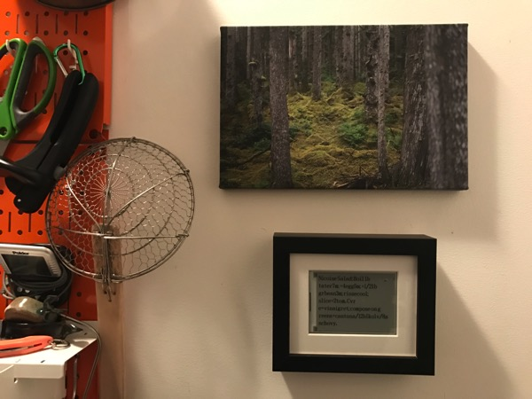
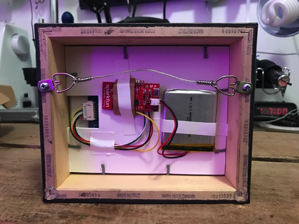

As you may have heard I’ve been having some [on-purpose downtime](https://notes.variogr.am/2016/11/16/leaving-spotify-the-echo-nest/) to catch up a bit on some personal projects. My time off has been a bit more existential than I initially planned on:

https://twitter.com/missokistic/status/796870708412358657

But it’s been going well, thank you for asking! I’ve been keeping busy / distracted by finally clearing out a long stack of personal projects, none with any commercial potential. I’ve noticed something interesting — when others use the word “hobbies” to describe what I’m up to, I recoil in fear, but I simultaneously downplay everything I work on in my studio in Greenpoint as temporary and “just for fun.” I should probably just own what I’m doing a bit more: it is _OK_ to do things that won’t end up changing the world. I see it as catch-up education after not building something I could touch for many, many years. 

I put together a nice WiFi enabled ePaper / e-Ink display to hang in the kitchen and show [@cookbook](https://twitter.com/cookbook?ref_src=twsrc%5Egoogle%7Ctwcamp%5Eserp%7Ctwgr%5Eauthor) recipes to inspire us to try different recipes. It was surprisingly fun and easy. I wrote up a [HOWTO guide on GitHub](https://github.com/bwhitman/paper-display), with all the connections, code and equipment you need (not much, and you can buy almost all of it on Sparkfun or Amazon.) It updates once an hour and picks a random tweet from a web service hosted on Google App Engine, but you can have it do whatever you’d like. I learned a lot about the [low power mode of the ESP8266](https://openhomeautomation.net/esp8266-battery/), and that combined with the EPD you’ve got a screen that can last years hanging on a wall with a 2000mAh battery. 

To be honest, I started down this path because I want an actual computer with an e-Ink display. I was hoping for a “[FreeWrite](https://getfreewrite.com/)” style keyboard & EPD combo with a larger work area and more functionality. I ended up buying embarrassingly large amounts of random EPD development boards off of eBay and DigiKey, and found that none yet are big enough or have good enough refresh rate to be slightly useable for a text-based interactive computer display. You can attempt to hack up a recent Kindle or Nook but it’s terribly fiddly. The [Pervasive Display](http://www.pervasivedisplays.com/kits) kits are close, as the newer models allow sub-region updates (you can tell the EPD to only update a bounding box instead of the whole thing, good for interactive text editing / display), but not big enough and geared towards Raspberry Pi “shields,” with fiddly I2C or SPI wiring arranged for their 40 pin headers. The board I used for this uses a simple serial protocol that anything can control, but takes almost a second to update the screen. [So I toned down my ambitious design and just made a nice object](https://github.com/bwhitman/paper-display). More of that to come.

